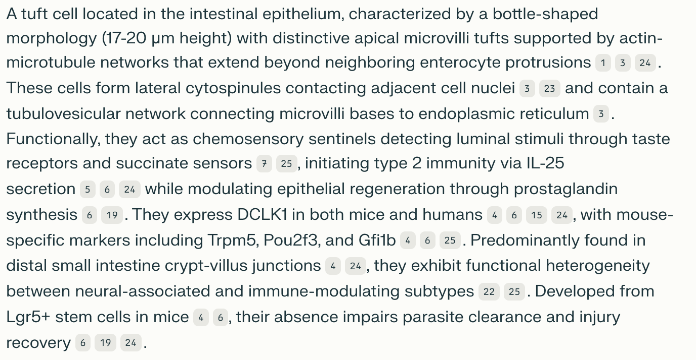

# A Guide to Using LLm Prompts to Generate Textual Definitions in the Cell Ontology (CL).

This guide explains how to efficiently use an LLM prompt to generate CL textual definitions and outlines the steps to refine them to align with CL definition guidelines.

## 1. Generate Definitions Using the Standard Prompt

### Standard LLM Prompt

> System Role: You are an expert cell biologist with extensive experience in creating precise and informative descriptions of cell types for ontologies.
> 
> User Role: I need you to create definitions for specific cell types to be included in the Cell Ontology. Each definition should:
> 1. Avoid naming the cell type being defined directly. It should start with a statement of a general classification for the cell type being defined, followed by the characteristics that distinguish it from other cell types within the same general classification.
> 2. Describe distinguishing characteristics, including structural features, functional roles, and anatomical context.
> 3. Include species-specific information when relevant, noting presence or absence in different organisms.
> 4. Mention key molecular markers, transcription factors, or genes only if they are crucial for identification or development of the cell type. When including molecular markers, specify the species in which they have been identified (e.g., "marker X in mice", "marker Y in humans").
> 5. For general cell types, focus on common features across different tissues or organs.
> 6. Include supporting references to key statements of the definition rather than listing them at the end.
> 7. Be concise yet comprehensive, aiming for 80-120 words in a single paragraph.
> 8. Use clear, scientific language accessible to biologists across various specialties.
> 
> Example output for a specific cell type:
> "A tuft cell that is part of the medullary epithelium of the thymus, characterized by lateral microvilli and specific markers, including L1CAM (1) in both mice and humans, as well as MHC II in mice (1,2). This cell is pivotal in immune functions such as antigen presentation, central tolerance, and type 2 immunity. It exhibits characteristics of both a medullary thymic epithelial cell (mTEC) and a peripheral tuft cell. Its development is governed by transcription factors such as POU2F3 (3,4)."
"Please generate a definition for the following cell type: '[INSERT CELL TYPE HERE]'" 

This standard prompt has been tested using Perplexity Free, PRO, and PRO R1, with all versions producing good results. PRO R1 provided the most detailed and informative definitions.

## 2. Refine the Definition 

Once the LLM generates a draft definition, follow these steps to refine the definition:

* Re-run the LLM prompt for improved output:
    * If the intial output lacks details or references, repeat the query multiple times. This often increases the likelihood of generating a more comprehensive and accurate definition.
    * For rare or harder-to-define cell types [EXAMPLE], consider modifying the prompt to provide additional context or specify key details.

* Remove redundant general information:
    * Edit out details that apply broadly to all cell types within a classification (e.g., general functions, common morphological features such as "description of tuft" for tuft cells), as these should already be captured in the general class definition.

* Review references:
    * Check the references provided by the LLM and ensure key statements in the definition have in-line text citations.

* Validate molecular marker specificity:

    * Retain only markers that are specific to the defined cell type.
    * Remove broadly expressed markers to avoid redundancy.
    * Ensure species-specific molecular markers are correctly attributed.

## Example Output 

### Cell Type Example: Intestinal Tuft cell

**First trial:** 

[Intestinal tuft cell perplexity query(1)](https://www.perplexity.ai/search/system-role-you-are-an-expert-Y.sx3Ep.RZOaXiL9SWiTyQ)

**Second trial:**

[Intestinal tuft cell perplexity query(2)](https://www.perplexity.ai/search/system-role-you-are-an-expert-_LdHdPqkQRmheizjzHasaQ)

### Refined defintion: 

A tuft cell that is part of the intestinal epithelium, characterized by a distinctive apical tuft and lateral cytospinules connecting to neighbouring cells. This cell senses luminal stimuli via taste receptors and succinate signalling, initiating type 2 immune responses through the secretion of interleukin-25 while modulating epithelial regeneration through prostaglandin synthesis. It expresses key molecular markers such as doublecortin-like kinase 1 (DCLK1) in mice (Hendel et al., 2022), and KIT proto-oncogene in humans (Huang et al., 2024). Developed from intestinal crypt stem cells, this cell requires transcription factor POU2F3 for its development.

